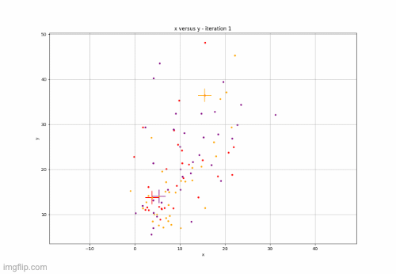
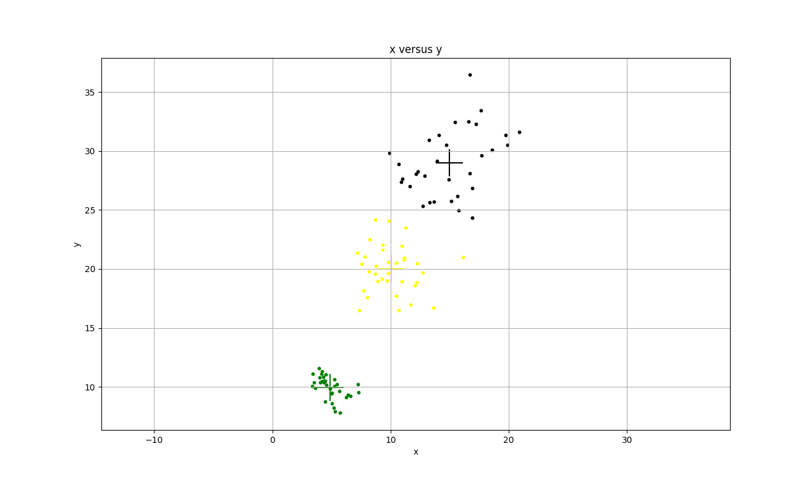
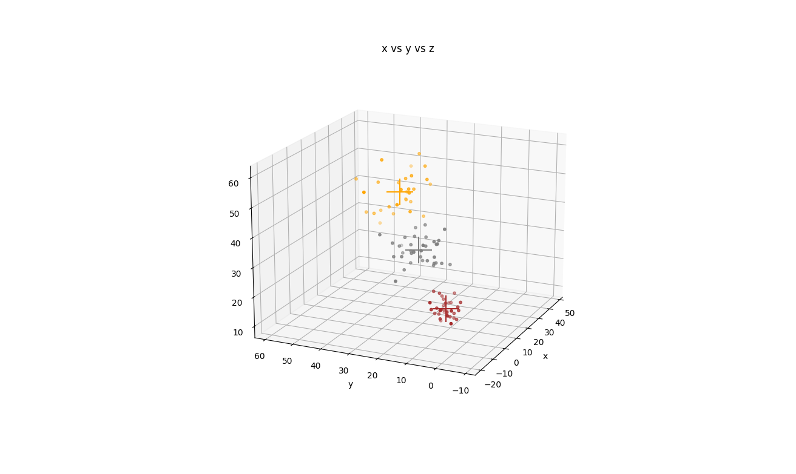
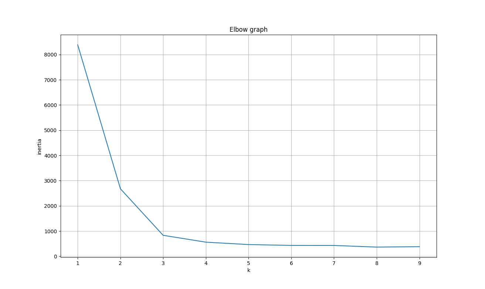
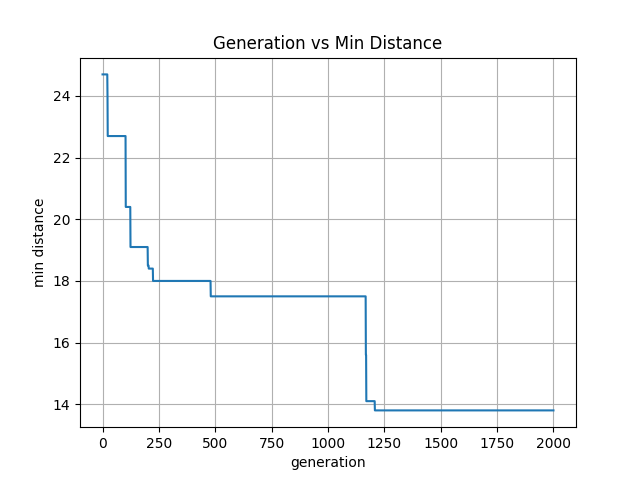

# Python algorithms
In this project I develop some machine learning algorithms from scratch using python. 
These algorithms implementations are not meant to be faster or better than the 
existing ones, but to be easy to understand and help the ones who are learning 
and believe that understanding how the algorithms works is important 🤓.

The only dependencies of this project are `numpy`, `pandas`. 
`matplotlib` is also a dependency only for some examples, but not the algorithms itself.

All the algorithms constructors and methods are as close as possible to the scikit. 
For example, all classification algorithms implements the predict/predict_proba methods

## ML algorithms implemented:

### Classification
| Algorithm | predict | predict_proba | continuous variables | categorical variables |
| - | - | - | - | - |
|Naive Byes|✅|✅|✅|✅|
|Decision Tree|✅|❌|❌|✅|

#### Naive Bayes
Implemented the Naive Bayes algorithm for both continuous and categorical variables. <br>

**Class constructor parameters**:

| param | type |description | required | default value |
| - | - | - | - | - |
|  continuous_variables | dict | dictionary to set if a variable is continuous or not, if a variable in the dataset is not present in this dict, the algorithm will infer. Example `{'awesome_feature': True, 'another_feature': False}` | false | {} |

##### How to use it
```python
import pandas as pd
from mlkit.classification.naive_bayes import NaiveBayes

df = pd.read_csv('examples/datasets/play_tennis.csv')
clf = NaiveBayes()
clf.fit(df.drop('target', axis=1), df['target'])

test = pd.DataFrame({'Outlook': ['Sunny'], 'Temperature': ['Hot'], 'Humidity': ['Normal'], 'Wind': ['Weak']})
print(clf.predict(test))
```
A full example can be found in:
* [Naive Bayes Categorical example](examples/classification/naive_bayes_categorical.py)
* [Naive Bayes Continuous example](examples/classification/naive_bayes_continuous.py)

References:
* https://www.ic.unicamp.br/~rocha/teaching/2011s2/mc906/aulas/naive-bayes-classifier.pdf
* https://www.atoti.io/how-to-solve-the-zero-frequency-problem-in-naive-bayes/
* https://towardsdatascience.com/continuous-data-and-zero-frequency-problem-in-naive-bayes-classifier-7784f4066b51

#### Decision Tree
Decision Tree implementation using ID3 algorithm.<br>

Class constructor parameters: There are no constructor parameters

##### How to use it
```python
import pandas as pd
from mlkit.classification.decision_tree import DecisionTree

  df = pd.read_csv('examples/datasets/play_tennis_continuous.csv')
  model = DecisionTree()

  model.fit(df.drop('target', axis=1), df['target'])
  x_test = pd.DataFrame({'Outlook': ['Sunny'], 'Temperature': ['Hot'], 'Humidity': ['Normal'], 'Wind': ['Weak']})
  print(model.predict(x_test))
```

A full example can be found in:
* [Decision Tree example](examples/classification/decision_tree_example.py)

References:
* https://towardsdatascience.com/decision-trees-for-classification-id3-algorithm-explained-89df76e72df1
* https://iq.opengenus.org/id3-algorithm/
* https://www.kdnuggets.com/2020/01/decision-tree-algorithm-explained.html

### Clustering

### K-Means
K-Means algorithm implementation using the euclidian distance method to measure distance.



Class constructor parameters:

| param | type | description | required | default value |
| - | - | - | - | - |
| k | int | number of clusters | true | |
| max_iter | int | max number of iterations | false | 50 |
| min_delta_iter | float | min difference between iteration to consider the training converged. This difference is calculated by computing the sum of distances of the cluster from one iteration for another | false | 0.01 |
| seed | int | seed value to apply for randomly commands | false | None |
| colors | list | list of colors to apply for each cluster. If not provided, then it will be randomly assigned | false | random |
| step_by_step | bool | Rather the training should be run step by step, plotting the intermediate cluster results | false | false |

##### How to use it
```python
import pandas as pd
from mlkit.clustering.kmeans import KMeans

df = pd.read_csv('awesome_dataset.csv')
model = KMeans(3, max_iter=1000)
labels = model.fit_predict(df)
model.plot()
```
The plot would look like this:

Or if the dataset has 3 features:

It is also possible to run the elbow method:
```python
import time
import pandas as pd
import matplotlib.pyplot as plt
from mlkit.clustering.kmeans import KMeans

process_init = time.time()
inertia_values = []
df = pd.read_csv('awesome_dataset.csv')
ks = range(1, 10)
for k in ks:
    model = KMeans(k)
    model.fit(df)
    inertia_values.append(model.inertia_)

plt.plot(ks, inertia_values)
plt.xlabel('k')
plt.ylabel('inertia')
plt.title('Elbow graph')
plt.grid()
plt.show()
```
The result would look like the following:


A full example can be found in
* [K-Means random dataset example](examples/clustering/kmeans_random_dataset_example.py)
* [K-Means Country Data](examples/clustering/kmeans_country_data_example.py)

### Optimization

#### Generic Algorithm
Generic Algorithm implementation.

Class constructor parameters:
| param | type | description | required | default value |
| - | - | - | - | - |
| chr_type | str, ChrType | chromosome type. possible values: binary (chromosome genes are represented as binary. Example: [1 0 1 1]), permutation (chromosome genes represents an order, each value appears only once. Example: [1, 3, 2, 4]), and value (chromosome genes represents any value. Example: [9 7 3 2])| false | ChrType.VALUE |
| gene_values | list | possible values that genes can take| false | None |
| max_gen | int | max generations | false | 100 |
| population_size | int | number of individuals in the population | false | 10 |
| n_chr | int | length of each chromosome, which means the length of each solution | If initial population not provided, then n_chr is required | None |
| p_mutation | float | probability of mutation happen in a specific individual | false | 0.005 |
| n_elitism | int | number of the best individuals that are forward to the next generation | false | 1 |
| parent_selection | str, ParentSelection | type of parent selection. The possible values are: fitness_proportionate, tournament (not implemented yet) | false | ParentSelection.FITNESS_PROPORTIONATE |

##### How to use it
```python
from mlkit.optimization.generic_algorithm.ga import GA
import numpy as np


def evaluate_salesman_travel():
    distances = np.array([
        [0, 4.8, 2.0, 1.6, 2.8, 3.3, 4.9, 2.3, 0.8],
        [4.8, 0, 3.6, 5.6, 6.8, 1.9, 9.6, 2.8, 5.6],
        [2.0, 3.6, 0, 2.1, 4.3, 2.0, 6.3, 2.1, 2.8],
        [1.6, 5.6, 2.1, 0, 4.0, 4.1, 4.3, 3.5, 1.9],
        [2.8, 6.8, 4.3, 4.0, 0, 6.2, 4.3, 4.1, 2.2],
        [3.3, 1.0, 2.0, 4.1, 6.2, 0, 8.3, 2.3, 4.5],
        [4.9, 9.6, 6.3, 4.3, 4.3, 8.3, 0, 7.1, 4.2],
        [2.3, 2.8, 2.1, 3.5, 4.1, 2.3, 7.1, 0, 2.9],
        [0.8, 5.6, 2.8, 1.9, 2.2, 4.5, 4.2, 2.9, 0]
    ])

    def evaluate(subject):
        return sum([distances[int(_from), int(to)] for _from, to in zip(subject, np.roll(subject, -1))]) * -1
    
    return evaluate


model = GA(max_gen=4000, chr_type='permutation', n_chr=9, replace=True, population_size=50)
best_solution, fitness_score = model.run(evaluate_salesman_travel())
print(f'solution: {best_solution} | fitness_score: {fitness_score}')
```
It is also possible to plot the result over the generations.
````python
model = GA(max_gen=2000, chr_type='permutation', n_chr=9, population_size=50)
best_solution, fitness_score = model.run(evaluate_salesman_travel())
plt.plot(range(0, len(model.best_fitness_score)), [v * -1 for v in model.best_fitness_score])
plt.grid()
plt.xlabel('generation')
plt.ylabel('min distance')
plt.title('Generation vs Min Distance')
plt.show()
````
For the example use case the result would be like the following:


A full example can be found in:
* [Genetic Algorithm example](examples/optimization/generic_algorithm_example.py)

References:
* https://www.tutorialspoint.com/genetic_algorithms/genetic_algorithms_parent_selection.htm
* https://www.tutorialspoint.com/genetic_algorithms/genetic_algorithms_crossover.htm
* https://core.ac.uk/download/4836412.pdf
